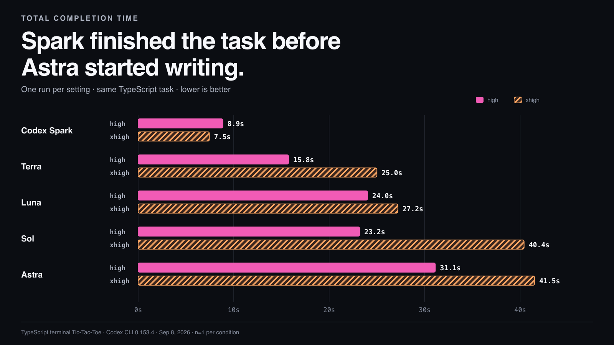
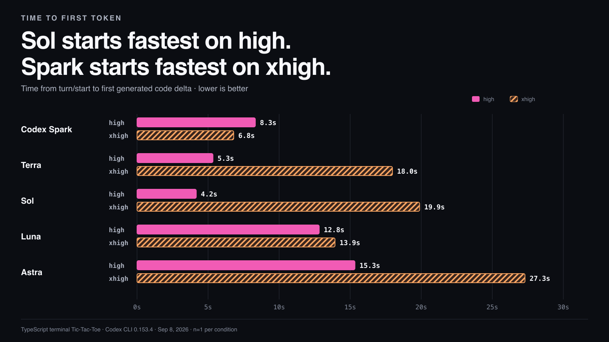
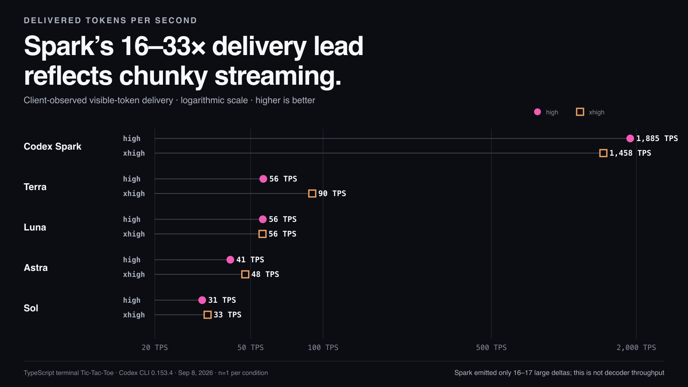

# Codex model benchmarks

This fork adds explicit **Normal / Fast** selection. A bounded two-run
[functionality smoke test](results/2026-10-02-smoke/README.md) passed using the
existing Codex subscription login. Original upstream results below are historical.

```bash
npm test
npm run bench -- --models gpt-5.6-sol --efforts high --service-tier normal
npm run bench -- --models gpt-5.6-sol --efforts high --service-tier fast
```

`--service-tier normal` is the default and explicitly sends `default` on every
turn, overriding an inherited Fast setting. `fast` resolves the model catalog's
Fast ID: `fast`, or legacy `priority` when that entry is named Fast. CLI 0.153.4
on the tested Mac advertises `priority`. The runner passes the ID to thread
creation and every turn, verifies thread acknowledgement, and refuses unavailable
tiers, RPC failures, observed tier mismatches, and model reroutes. It never retries
with a cheaper/slower tier. Fast uses more subscription allowance; see
[official Codex speed documentation](https://developers.openai.com/codex/agent-configuration/speed).

The runner reads every `model/list` page, including hidden models. Catalog
omission is not necessarily backend access denial. To test an **explicit model
ID** that is missing from the catalog, opt in:

```bash
npm run bench -- --models gpt-6.1-sol --efforts high --service-tier normal --allow-unlisted-model
npm run bench -- --models gpt-6.1-sol --efforts high --service-tier fast --allow-unlisted-model
```

This prints and records a warning and skips catalog-only capability checks for
that model. The exact model ID is sent with provider fallback disabled; a different
resolved model, model reroute, or backend rejection remains an error. For an
unlisted Fast attempt, the runner requires one unambiguous Fast protocol ID from
the CLI catalog; this establishes wire spelling, **not** model access or tier
support. Summaries retain catalog pagination evidence, requested and resolved
models, thread acknowledgement, warnings, and errors even when setup fails.
`--allow-unlisted-model` requires an explicit `--models` selection.

### Use the same CLI runtime as your desktop

A stale executable on PATH can expose a different model catalog and produce
misleading access errors. On the tested Mac, PATH used **0.153.4**, while the
installed desktop bundled **0.159.0-alpha.12.1**. The old CLI omitted and rejected
`gpt-6.1-sol`; the desktop binary advertised that exact model and its Fast tier.
This was a runtime compatibility issue, not evidence that the user's desktop
account lacked Sol 6.1. The current [official model documentation](https://developers.openai.com/codex/models)
includes GPT-6.1 Sol in Codex desktop and CLI.

Select the executable explicitly (the bundled path depends on the installation):

```bash
npm run bench -- \
  --codex-bin /Applications/ChatGPT.app/Contents/Resources/codex-cli/bin/codex \
  --models gpt-6.1-sol --efforts high --service-tier fast
```

`--codex-bin` controls both version detection and app-server launch. Its default
is `codex` from PATH; the selected executable and its exact version are recorded
in every summary. Arguments are passed directly without a shell, including paths
with spaces. This does not update global software, change credentials, or modify
your Codex configuration. Prefer the compatible runtime over bypassing catalog
preflight with `--allow-unlisted-model`.

The corrected runtime completed both `gpt-6.1-sol` / High samples with zero
errors or reroutes: Normal TTFT **18.589s**, delivered **45.892 TPS**, total
**34.053s**; Fast TTFT **17.594s**, delivered **50.602 TPS**, total **33.740s**.
Thread acknowledgements were `default` and `priority`; effective backend tier
was not exposed. Both generated games passed the existing checker. These were
single sequential samples, not a statistically controlled speed comparison.

Schema v2 records requested UI tier, protocol ID, thread acknowledgement, and
an effective tier **only if explicitly observable in upstream response metadata**.
Thread acknowledgement is not proof of backend processing. The tested CLI exposed
no effective tier: the field remains `null`. Missing token/timing data likewise
remains `null`, not zero. Diagnostic stderr and raw notifications are not saved;
protocol errors and partial results are recorded in `summary.json`, with nonzero
exit status for failure. Each RPC and turn has a bounded timeout. The benchmark
has no npm dependencies and leaves your global Codex configuration unchanged.

Use a fresh output directory per invocation; summary files replace previous
summaries at the same path. Tier-specific generated filenames prevent code from
different tiers colliding. `--delay-ms` now defaults to zero. This is still a
latency runner, not a statistical quality or performance evaluation.



A reproducible, Codex-layer latency test across GPT-6 Astra, GPT-5.6 Sol,
GPT-5.6 Terra, GPT-5.6 Luna, and GPT-5.3 Codex Spark.

In this run, Spark completed the entire task before Astra emitted its first
code token. All ten generated programs compiled and completed a scripted game.

## Metric cards

Each card leads with the interpretation and uses the chart as supporting
evidence.





The original combined latency view is available as
[`assets/codex-model-latency.png`](assets/codex-model-latency.png).

## Results

One run per model and reasoning-effort setting on September 8, 2026. Lower is
better for TTFT and total time; higher is better for delivered TPS.

| Model | Effort | TTFT | Delivered TPS | Total | Visible / reasoning tokens |
| --- | --- | ---: | ---: | ---: | ---: |
| GPT-5.3 Codex Spark | high | 8.3s | 1,885* | **8.9s** | 797 / 4,227 |
| GPT-5.3 Codex Spark | xhigh | **6.8s** | 1,458* | **7.5s** | 765 / 2,667 |
| GPT-5.6 Terra | high | 5.3s | 56 | **15.8s** | 580 / 0 |
| GPT-5.6 Terra | xhigh | 18.0s | 90 | **25.0s** | 620 / 516 |
| GPT-5.6 Luna | high | 12.8s | 56 | 24.0s | 621 / 516 |
| GPT-5.6 Luna | xhigh | 13.9s | 56 | 27.2s | 735 / 516 |
| GPT-5.6 Sol | high | **4.2s** | 31 | 23.2s | 594 / 0 |
| GPT-5.6 Sol | xhigh | 19.9s | 33 | 40.4s | 674 / 422 |
| GPT-6 Astra | high | 15.3s | 41 | 31.1s | 646 / 157 |
| GPT-6 Astra | xhigh | 27.3s | 48 | 41.5s | 667 / 482 |

\* Spark delivered its answer in 16–17 large stream chunks. Its measured TPS
is the rate observed by the Codex client, not a directly comparable estimate
of decoder throughput.

The exact measurements are in
[`results/2026-09-08/summary.json`](results/2026-09-08/summary.json). The ten
generated programs are preserved in
[`results/2026-09-08/generated`](results/2026-09-08/generated).

## What is measured

- **TTFT:** time from sending `turn/start` to the first
  `item/agentMessage/delta` containing generated code.
- **Delivered TPS:** visible output tokens divided by the time between the
  first and final code delta. Visible tokens are output tokens minus reasoning
  tokens.
- **Total:** time from sending `turn/start` to `turn/completed`.

The runner uses Codex's app-server JSONL stream because `codex exec --json`
emits completed messages rather than text deltas, and Spark is not exposed
through the public API on the tested account. See the official
[Codex app-server documentation](https://learn.chatgpt.com/docs/app-server).

## Reproduce

Requirements:

- Node.js 22 or newer
- Codex CLI 0.153.4 or newer
- A ChatGPT account signed into Codex

```bash
git clone https://github.com/bald-ai/codex-model-benchmarks.git
cd codex-model-benchmarks
codex login status
npm run bench
```

The runner creates a timestamped folder under `runs/` containing a sanitized
`summary.json` and each generated TypeScript program. It does not persist the
raw app-server event stream.

To select models or efforts:

```bash
npm run bench -- \
  --models gpt-5.6-terra,gpt-5.3-codex-spark \
  --efforts high,xhigh \
  --output runs/terra-vs-spark
```

Rendering the committed chart requires
[`rsvg-convert`](https://gitlab.gnome.org/GNOME/librsvg):

```bash
npm run chart:png
npm run cards:png
```

## Method and limitations

1. Every original September 8 run used the same user prompt and benchmark instructions, no tool
   calls, the default service tier, and a fresh ephemeral Codex thread.
2. Runs were sequential and interleaved across models to reduce ordering bias.
3. This is one observation per condition. It is a transparent snapshot, not a
   latency distribution or service-level claim.
4. Codex injects model-specific system context. Total input ranged from 18.2K
   to 20.9K tokens even though the task context was identical.
5. The app-server protocol is experimental. Pin the Codex CLI version when
   comparing results over time.

## Prompt

> Generate a complete, runnable TypeScript program for a two-player
> Tic-Tac-Toe game played in a terminal. It must use Node.js's built-in
> readline module, render a numbered 3x3 board, alternate X and O, validate
> input, reject occupied cells, detect wins and draws, announce the result,
> and close cleanly. Produce the solution in one response. Return only
> TypeScript source code, with no Markdown fences, preamble, explanation, or
> follow-up.

## License

MIT
